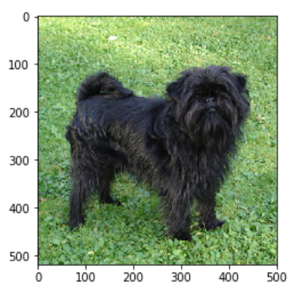
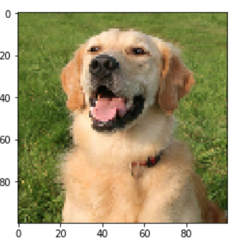
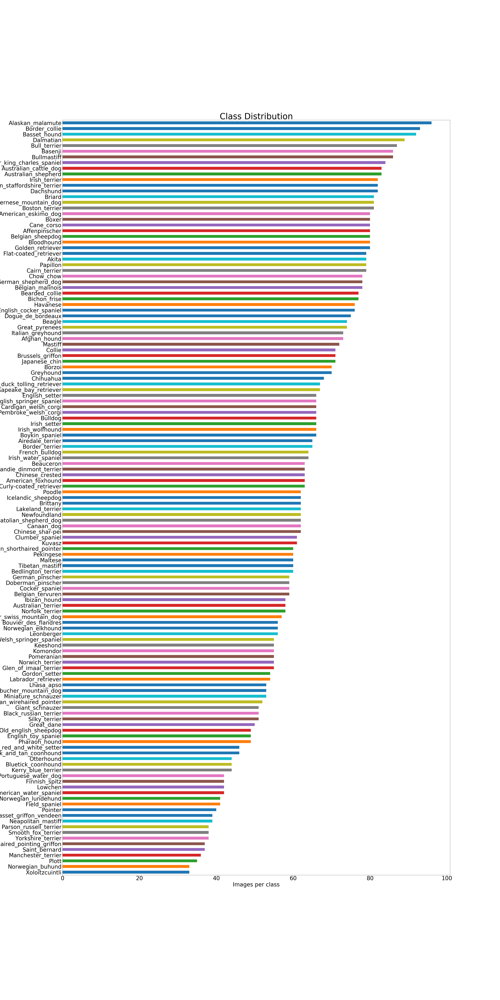
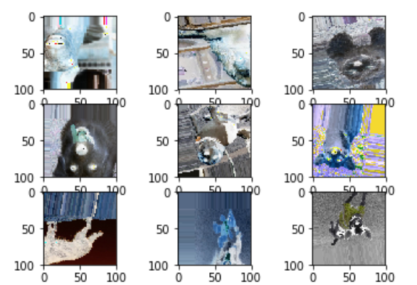
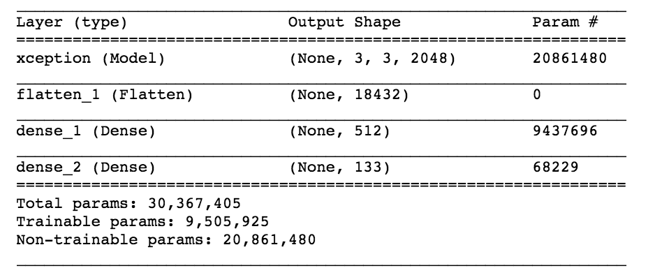

# Dog-Breed-Identification

This repository presents my attempt to build a dog breed identifier tool using neural network designed with [Keras](https://keras.io/).  

This work is inspired by the [Kaggle Dog Breed Identification Challenge](https://www.kaggle.com/c/dog-breed-identification)(I did not take part in the competition because it was too late to submit). However, being a doggo friend, I enjoyed the topic and wanted to take the opportunity to improve my skills in computer vision! So, I took a dog breed identification dataset and built my own classifier. 

As specified on Kaggle: <i>You are provided with a training set and a test set of images of dogs. Each image has a filename that is its unique id. The dataset comprises 120 breeds of dogs. The goal of the competition is to create a classifier capable of determining a dog's breed from a photo. </i>  
The dataset is composed of 133 different breeds with 8350 pictures in total. The number of pictures per breed goes roughly from 25 to 100.   

Then, it's not enough to train a neural network. It will overfit the images and so the error on the test set will be high.   
To deal with it, I will apply the two methodologies: 
 - Data augmentation of the training set: I apply several transformations in the training set images in order to create new images with the same label. It will make the CNN more robust to any small variation in the images.
 - I'll use a pre-trained neural net, use it as the first part our my classifier and modify it to fit in this problem.

<u>Remark:</u> Because of the lack of power resource (especially I don't have GPU), I wasn't able to run the code and get the results with a great accuracy. However, this code works perfectly well and it will be possible to select the best model once trained on GPU. 

This is a multi-label classification, with 133 labels.

The evaluation metric is accuracy score. 

The project is decomposed in 3 parts:

The framework of this notebook is:
- Data-Augmentation
- CNN Architecture:
    - Pre-trained Model
    - Customized Model
- Training & Testing
- Identify the breed of dogs

## Data-Augmentation

The number of images per breed is too small in the dataset. 

It makes the model more likely to overfit. The first step is to proceed to the augmentation of the input data. 

We can operate several operations to augment the number of images. Moreover, the customer is not a professional photographer, so this kind of transformation is necessary to add robustness to the 'amateurism' of the photo:
- Scaling: dog can be big or small 
- Translation: dog is not well in the middle of the picture
- Rotation(90 degree): Let's take the example of smartphone, there are commonly 3 different angles to take the picture (vertical, or horizontal both side). it's done with the flipping
- Rotation (range of angles): we do it to traduce the fact the customer won't be perfectly vertical when taking the picture. But we won't take a too big range because it creates a black background.
- Adding Salt and Pepper noise: some white and black pixels are add to mimic the un-perfectness of a user's camera. (need to be done to improve the model)
- Lighting condition: really important because the lightning changes a lot following the picture conditions. (need to be done to improve the model)

Practically, I used the [keras train generator](https://keras.io/preprocessing/image/) built-in function. 

## CNN Architecture

In general, to build our model, we can do:
- build from scratch a CNN model
- use a pre-trained model, then customize last layers

Because of the previous reasons and the low number of data, we will use a pre-trained model. 

### Pre-trained Model

[Pre-trained models](https://keras.io/applications/) are here advantageous because:
- I don't have a huge amount of labeled data, so I'll get approximate value of the parameters of the Neural Network
- save computational time (the pre-trained model is not trainable - the weights are not changed)

With keras, we can have access to several models (in bold the one tested here):
- AlexNet
- <b>VGGNet</b>
- Inception
- ResNet
- <b>Xception</b>
- MobileNet
- SqueezeNet

### Customized Part 

My final architecture is:
 - One pre-trained model (CNN part belongs to it)
 - One flatten layer
 - One hidden layer (512 neurons)
 - One output layer (133 neurons)

## Training & Testing

The framework is to split the dataset into one training and one testing (80% for the training). Then, the 2 models ((VGGNet + customized) & (Xception + customized)) are trained using 80% of the dataset. Then 10% are used as validation set during the training. 
The remaining 10% are used to test both models and choose the best one. 

<u>Remark:</u> Having no GPU, I can't train the models so the results are not representative of the real performances. After an hour of training, we went from 1% to 15% of accuracy which is much more than 1/133 (nb of labels). So, with more training time we can go to a better accuracy. 

### Training of Xception

### Training of VGGNet

## Identify the breed of dogs

Using the best model, I am able now (once trained with a GPU) to identify the breed of dogs or even to know which breed a human face looks alike ! 

## Conclusion

As seen, it is possible to build a neural network to identify the breed of dogs.  

We can imagine to build such a model to also identify from a picture the age (at least young/old, given we already know the breed), the gender and the presence of diseases. From this informations, an insurance company can make a better pricing of insurance plans. 
Technically, it would be possible to improve the model through:
- Because there are many breeds, it generate inaccuracy. Therefore, I imagine to reduce the number of labels to get a better accuracy. Indeed, from an insurance point of view, maybe there already exists clustering of the dogs in different groups. So, I can use the same clusters.
- Because, I don't have many images per label, I can enhance the dataset with more pictures from public or even private datasets. 
- I tried only 2 models, other can be used. 
- I did not use all the method to augment the number of image (salt and pepper, lightning...)
- I can improve the architecture(more layers, more neurons per layer) of the customized part of the network or even build a network from scratch.

## Author

* **Selim Amrouni** [selimamrouni](https://github.com/selimamrouni)

